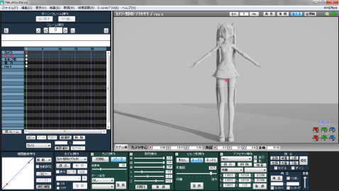
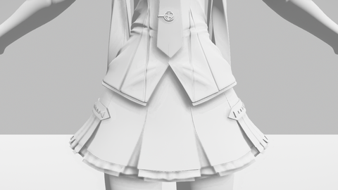
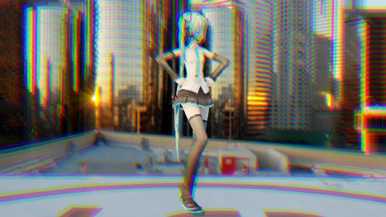

# ·Ray的全局设置和MME效果分配
[返回目录](../ReadMe.md) 
 
[上一章 4.入门使用](started.md)
## 说明
本章介绍了Ray.conf和ray_advanced.conf以及MME不同选项卡的不同用处。
## 全局设置

* 　ray-mmd的根目录中有两个设置文件，分别是 `ray.conf`和 `ray_advanced.conf`。其中 `ray.conf`是需要你自己根据自己的需求进行重新设置的。而 `ray_advanced.conf`基本不需要修改，除非你有这方面的开发经验，准备设置自己的渲染。  

    | 文件名         | 说明 |
    | :----------------- | :--- |
    | ray.conf           | ray-mmd的全局设置，根据自我需求进行设置。 |
    | ray_advanced.conf  | ray-mmd的另一个全局设置，基本不需要更改。 |

* 在你打开MMD并载入mmd后更改`ray.conf`，效果不会实时更新。你可以根据以下方法进行更新，都需要一段时间等待  
    * 先将当前MMD工程保存并关闭，修改`ray.conf`后再打开MMD重新载入工程。
    * 在MMEfect菜单中执行「全部更新」（「全て更新」）。

## ray.conf的设置

Sun light
-----
* MMD的「照明操作」面板上的灯光设置。用作充当阳光  

    ### `SUN_LIGHT_ENABLE`
    太阳光的设置

    `0` ：关闭  
    `1` ：开启　(默认选项)  
    `2` ：开启：根据角度计算光的强度  

    |  | SUN_LIGHT_ENABLE 0 | SUN_LIGHT_ENABLE 1 | SUN_LIGHT_ENABLE 2 |
    | :- | :- | :- | :- |
    | 光的位置 高 |  |  |  |
    | 光的位置 低 |  |  |  |

    ※点击图片放大来显示详细的图形。

SUN_SHADOW_QUALITY
-----
    阳光下阴影的质量设置，数字越大，阴影质量越高，但使用的内存越多，对电脑的要求就越高。对于低性能电脑推荐降低数字来提高渲染速度。

    ### `SUN_SHADOW_QUALITY`
  

    `0` ：None  
    `1` ：Low    ( 512 * 4)  
    `2` ：Medium (1024 * 4)  
    `3` ：High   (2048 * 4)　(默认)  
    `4` ：boom!  (4096 * 4)  
    `5` ：boom!! (8192 * 4)  

    | SUN_SHADOW_QUALITY 1 | SUN_SHADOW_QUALITY 2 | SUN_SHADOW_QUALITY 3 | SUN_SHADOW_QUALITY 4 | SUN_SHADOW_QUALITY 5 |
    | :- | :- | :- | :- | :- |
    |  |  |  |  | 因为电脑内存不足，无法输出这张图片，自己比较前面就好了。 |

Image Based Lighting
-----
* Skybox的UV是否反转的设置。  
    这个设置主要是为了在使用了你自己的HDR贴图作为空间球时，根据场景情况选择是否反转。

    ### `IBL_QUALITY`

    `1` ：UV不反转　(默认)  
    `2` ：UV反转

    | IBL_QUALITY 1 | IBL_QUALITY 2 |
    | :- |:- |
    |  |  |
    | 原本的贴图的时候，万豪酒店的标志是颠倒的 | 万豪酒店的标志恢复正常 |

    ※ 光照信息根据天空球进行改变

Fog Tab
-----
* MME效果分配中的「FogMap」是否开启，如果不开启，额外添加的雾也无法使用。

    ### `FOG_ENABLE`

    `0` ：关闭  
    `1` ：开启　(默认)  

Light Tab
-----
* MME效果分配中的「LightMap」是否开启，如果不开启，额外添加的灯也无法使用。

    ### `MULTI_LIGHT_ENABLE`

    `0` ：关闭  
    `1` ：开启　(默认)  

Outline Tab
-----
* MME效果分配中的「OutlineMap」是否开启。此项为轮廓线。

    ### `OUTLINE_QUALITY`

    `0` ：不添加　(默认)  
    `1` ：无抗锯齿添加  
    `2` ：添加+抗锯齿SMAA  
    `3` ：添加+抗锯齿SSAA  

    | OUTLINE_QUALITY 0 | OUTLINE_QUALITY 1 | OUTLINE_QUALITY 2 | OUTLINE_QUALITY 3 |
    | :- | :- | :- | :- |
    |  |  |  |  |

Toon-shading material
-----
* 是否启用卡通材质渲染，如果你在材质设置中使用了卡通材质（`CUSTOM_ENABLE 8`或`9`），则需要启用它。

    ### `TOON_ENABLE`

    `0` ：不开启　(默认)  
    `1` ：开启  
    `2` ：开启 + 光扩散

    | TOON_ENABLE 0 | TOON_ENABLE 1 | TOON_ENABLE 2 |
    | :- | :- | :- |
    |  |  |  |

    ※ 在`BOKEH_QUALITY 1`、`OUTLINE_QUALITY 3`、`Materials`属性中设置`CUSTOM_ENABLE 8`时的三个选项的预览效果。

Screen Space Directional Occlusion
-----
* Screen Space Directional Occlusion(SSDO:考虑光线方向AO)更加高质量的阴影。有关SSDO的[说明文档](https://www.slideshare.net/ozlael/mssao-presentation)  
    数值越高，效果越好，要求的性能越强。

    ### `SSDO_QUALITY`

    `0` ：无SSDO  
    `1` ： 8 samples  
    `2` ：12 samples　(默认)  
    `3` ：16 samples  
    `4` ：20 samples  
    `5` ：24 samples  
    `6` ：28 samples  

    | SSDO_QUALITY 0 | SSDO_QUALITY 1 | SSDO_QUALITY 2 | SSDO_QUALITY 3 | SSDO_QUALITY 4 | SSDO_QUALITY 5 | SSDO_QUALITY 6 |
    | :- | :- | :- | :- | :- | :- | :- |
    |  |  |  |  |  |  |  |

    ※ 为了让对比更加明显，我设置了SUN_SHADOW_QUALITY 0、控制器SSAO- 1、SSDO+ 3的设定。

Screen Space Reflection
-----
* Screen Space Reflection(SSR)屏幕空间反射(镜面反光)。  
    随着数值的增加，效果更好，要求的性能越强。
    ### `SSR_QUALITY`

    `0` ：SSR無し　(デフォルト)  
    `1` ： 32 samples  
    `2` ： 64 samples  
    `3` ：128 samples  

    | SSR_QUALITY 0 | SSR_QUALITY 1 | SSR_QUALITY 2 | SSR_QUALITY 3 |
    | :- | :- | :- | :- |
    |  |  |  |  |

Screen Space Subsurface Scattering
-----
* Screen Space Subsurface Scattering(SSSSS)屏幕空间次表面散射。  
    用于皮肤、玉器等效果的制作，效果请自己拿一个手电筒压在手指上照射，手指透过的红色便是这种效果。

    ### `SSSS_QUALITY`

    `0` ：关闭  
    `1` ：开启　(默认)  

Bokeh
-----
* DOF (Depth of Field:景深)景深效果。  
    其余的设置请参考`ray_controller.pmx`的设置。

    ### `BOKEH_QUALITY`

    `0` ：关闭　(默认)  
    `1` ：开启  

    | BOKEH_QUALITY 0 | BOKEH_QUALITY 1 |
    | :- | :- |
    |  |  |
    |  |使用ray_controller调整不同的景深效果 |

Eye Adaptation
-----
* Eye Adaptation (Auto-Exposure・自动曝光・明暗适应)启用人眼适应。  
    Eye Adaptation指的是人眼的光暗自动适应效果，请参考你刚从洞窟中走出眼前一片白光，和刚进入洞窟眼前一片漆黑，过一段时间能正常看清的效果。  具体请参考英文[说明文档](https://docs.unrealengine.com/latest/INT/Engine/Rendering/PostProcessEffects/AutomaticExposure/index.html)

    ### `HDR_EYE_ADAPTATION`

    `0` ：关闭　(默认)  
    `1` ：开启　ISO 100 中间灰度值为12.7%  
    `2` ：开启　ISO 100 中间灰度值为18.0%（标准反射率）  

Bloom
-----
* 光溢出

    ### `HDR_BLOOM_MODE`
	
	具体请参考英文[说明文档](http://kalogirou.net/2006/05/20/how-to-do-good-bloom-for-hdr-rendering/)或中文[说明文档](https://docs.unrealengine.com/latest/CHN/Engine/Rendering/PostProcessEffects/Bloom/index.html)
	
	`0` ：关闭  
    `1` ：inf                                 : 1.0.0以前的效果  
    `2` ：saturate                            : 1.0.0版本时的效果  
    `3` ：luminance & exposure                : 1.2.0版时的效果  
    `4` ：saturate & exposure　(默认)   : 1.3.0以上版本的效果

    | HDR_BLOOM_MODE 0 | HDR_BLOOM_MODE 1 | HDR_BLOOM_MODE 2 | HDR_BLOOM_MODE 3 | HDR_BLOOM_MODE 4 |
    | :- | :- | :- | :- | :- |
    |  |  |  |  |  |

Simple lensflare
-----
* 镜头光晕开启和颜色设置。

    ### `HDR_FLARE_MODE`

    `0` ：关闭　(默认)  
    `1` ：Blue （耀斑为蓝）  
    `2` ：Orange （耀斑为橙）  
    `3` ：Auto （耀斑与光源同色）  

    | HDR_FLARE_MODE 0 | HDR_FLARE_MODE 1 | HDR_FLARE_MODE 2 | HDR_FLARE_MODE 3 |
    | :- | :- | :- | :- |
    |  |  |  |  |

Simple glare star
-----
* 由镜头眩光产生的光线类型

    ### `HDR_STAR_MODE`

    `0` ：关闭　(默认)  
    `1` ：Anamorphic Lens Flares // blue  
    `2` ：Anamorphic Lens Flares // auto  
    `3` ：Glare star // orange  
    `4` ：Glare star // auto  

    | HDR_STAR_MODE 0 | HDR_STAR_MODE 1 | HDR_STAR_MODE 2 | HDR_STAR_MODE 3 | HDR_STAR_MODE 4 |
    | :- | :- | :- | :- |:- |
    |  |  |  |  |  |

Tonemapping
-----
* 色调映射模式。  
    ray-mmd内部处理的图像数据HDR通过转换为LDR，并在显示器上显示，请选择色调映射的模式。

    ### `HDR_TONEMAP_OPERATOR`

    `0` ：Linear  
    `1` ：Reinhard  
    `2` ：Hable  
    `3` ：Uncharted2  
    `4` ：Hejl2015　(默认)  
    `5` ：ACES-sRGB  
    `6` ：NaughtyDog  

    | HDR_TONEMAP_OPERATOR 0 |HDR_TONEMAP_OPERATOR 1 |HDR_TONEMAP_OPERATOR 2 |HDR_TONEMAP_OPERATOR 3 |HDR_TONEMAP_OPERATOR 4 |HDR_TONEMAP_OPERATOR 5 |HDR_TONEMAP_OPERATOR 6 |
    | :- | :- | :- | :- | :- | :- | :- |
    |  |  |  |  |  |  |  |

Anti-Aliasing
-----
* 抗锯齿效果。  
    FXAA的性能消耗比较低，精度也较低，SMAA的精度更高，性能要求也更高，SMAA可能在AMD显卡上不支持。

    ### `AA_QUALITY`

    `0` ：关闭  
    `1` ：FXAA　(默认)  
    `2` ：SMAAx1-medium // maybe, AMD graphics card does not support  
    `3` ：SMAAx1-high  
    `4` ：SMAAx2-medium  
    `5` ：SMAAx2-high  

    | AA_QUALITY 0 | AA_QUALITY 1 | AA_QUALITY 2 | AA_QUALITY 3 | AA_QUALITY 4 | AA_QUALITY 5 |
    | :- | :- | :- | :- | :- | :- |
    |  |  |  |  |  |  |

Postprocess Dispersion
-----
* 后处理色散
	控制器中左下表情Dispersion（色散）的表现方式

    ### `Postprocess Dispersion`

    `0` ：关闭  
    `1` ：色移　(默认)  
    `2` ：色差 

	| Postprocess_Dispersion 0 | Postprocess_Dispersion 1 | Postprocess_Dispersion 2 |
	| :- | :- | :- |
	|  |  |  |

	※ 为了让对比更加明显，我设置了控制器Dispersion+1的设定。

# ray_advanced.conf的设置
    static const float mLightIntensityMin = 1.0;
    static const float mLightIntensityMax = 10.0;
    static const float mLightDistance = 1000;
    static const float mLightPlaneNear = 0.1;
    static const float mLightPlaneFar = 400.0;
    static const float mTemperature = 6600.0; // range 1000 ~ 40000 // Default value used D66 for pure wihte
    static const float mEnvLightIntensityMin = 1.0;
    static const float mEnvLightIntensityMax = 6.2831852;
    static const float mBloomIntensityMin = 1.0;
    static const float mBloomIntensityMax = 20.0;
    static const float mBloomGhostThresholdMax = 10.0;
    static const float mExposureMin = 2.0;
    static const float mExposureMax = 8.0;
    static const float mExposureEyeAdapationMin = 0.0;
    static const float mExposureEyeAdapationMax = 8.0;
    static const float mVignetteInner = 1.0;
    static const float mVignetteOuter = 3.5;
    static const float mPointLightNear = 1.0;
    static const float mPointLightFar  = 400.0;
    static const float mPSSMCascadeZMin = 5;
    static const float mPSSMCascadeZMax = 1500;
    static const float mPSSMCascadeLambda = 0.5;
    static const float mPSSMDepthZMin = 0;
    static const float mPSSMDepthZMax = 4000.0;
    static const float mSSRRangeMax = 1000.0;
    static const float mSSRRangeScale = 0.75;
    static const float mSSRThreshold = 1.0;
    static const float mSSRFadeStart = 0.8;
    static const float mSSSSIntensityMin = 0.04;
    static const float mSSSSIntensityMax = 0.02;
    static const float mSSDOParams[4] = {2.0, 2.0, 0.03, 0.15};
    static const float mSSDOBiasNear = 0.125;
    static const float mSSDOBiasFar = 0.0005;
    static const float mSSDOBiasFalloffNear = 20.0;
    static const float mSSDOIntensityMin = 2.4;
    static const float mSSDOIntensityMax = 10.0;
    static const float mSSDOBlurFalloff = 200.0;
    static const float mSSDOBlurSharpnessMin = 1.0;
    static const float mSSDOBlurSharpnessMax = 8.0;
    static const float mFXAAQualitySubpix = 0.5;
    static const float mFXAAQualityEdgeThreshold = 0.166;
    static const float mFXAAQualityEdgeThresholdMin = 0.0333;

- ## MME的「效果分配」说明

当使用ray-mmd后，MME的「效果分配」的各个选项卡需要自行设置`.fx`。`ray.conf`会使某个选项卡删除或增加。  
　有关应该在各个选项卡上分配的fx应该如何设置，请参考各章的说明。

| 选项卡名字      | 选项卡名称                     | 说明   |
| :---------- | :------------------------------- | :- |
| Main        | Main Render Target               | 对材质的宏观设定，具体请参考[11.Main设置](main.md)
| FogMap      | Multi volumetric fog for ray     |ray.conf中有该选项卡的开关， 添加「Fog」文件夹中的雾或加入带有雾的Skybox中，设置雾属性的选项卡，具体设置请参考[10.雾](fog.md)
| LightMap    | Multi light source for ray       | ray.conf中有该选项卡的开关，添加「Lighting」文件夹中的灯，设置灯属性的选项卡，具体设置请参考[9.光源](light.md)
| EnvLightMap | Image-based-lighting map for ray | 添加「Skybox」文件夹中的skybox后，添加skybox的光照信息的选项卡，具体请参考[7.天空球控制](skybox.md)
| MaterialMap | Material cache map for ray       | 添加「Material」中的材质文件或自制的材质文件，具体请参考[8.材质设定](materials.md)。
| OutlineMap  | Outline shading for ray          | ray.conf中有该选项卡的开关，轮廓线设置，可以在「Outline」文件夹中选择轮廓线的样式，具体请参考[13.轮廓线](outline.md)
| SSAOMap     | SSAO visibility for ray          | 阴影可见度设置，添加「Shadow」文件夹中的SSAO visibility～的fx文件来设置，默认为`SSAO visibility 1.0.fx`，具体请参考[12.阴影](shadow.md)
| PSSM1～4    | cascade shadow map for ray       | 来自阳关阴影的设定，无需更改，具体请参考[12.阴影](shadow.md) |

如果你加入的光源的`.fx`是带有阴影的，则会添加阴影贴图选项卡，具体信息请参考[9.光源](light.md)。

-----

<small> Model : Hatsune Miku V4X Model by Digitrevx / Japanese Otaku City by ZENRIN / S_N_Fes ステージ by cubp / トレーニングステージ by 名無し  感谢gaj-cg教程中出现的大部分图片可以直接使用</small>