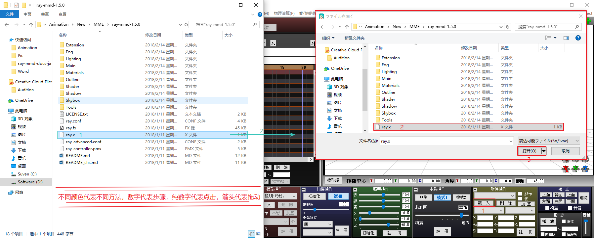
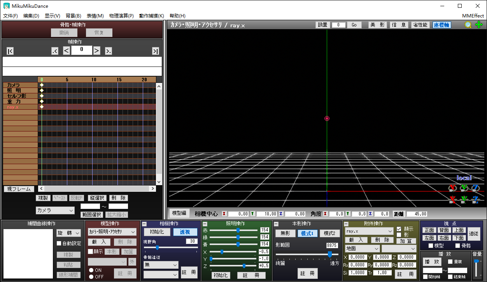
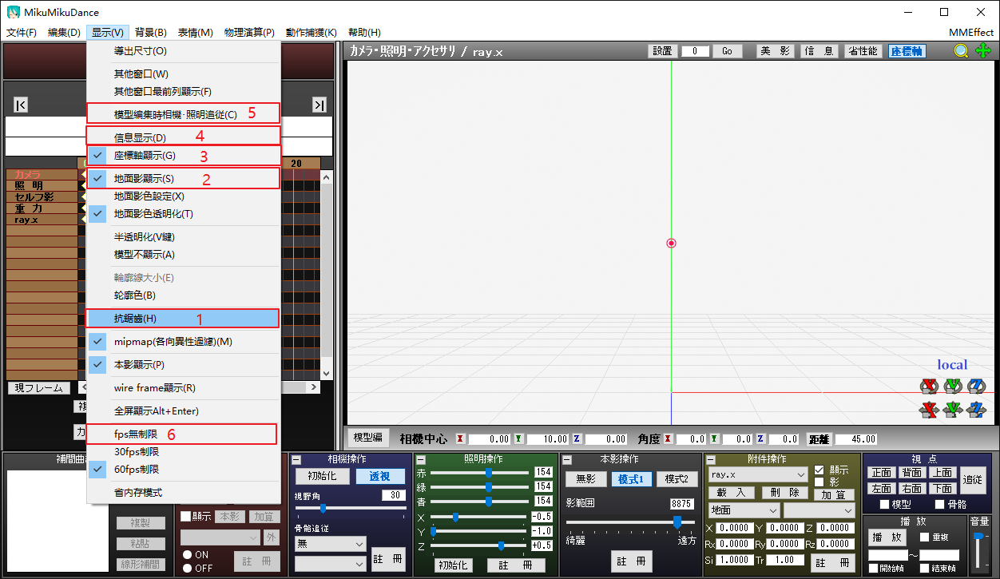
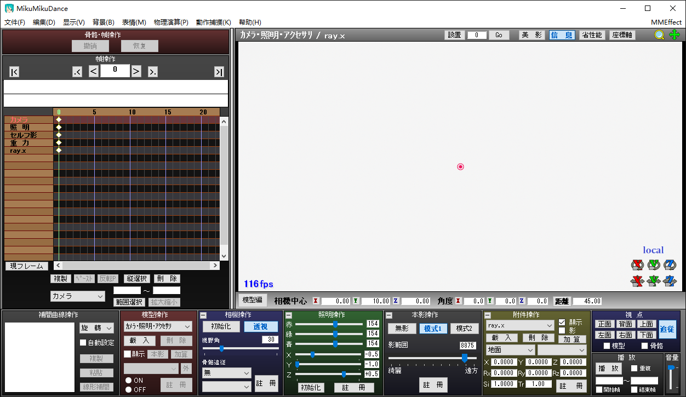
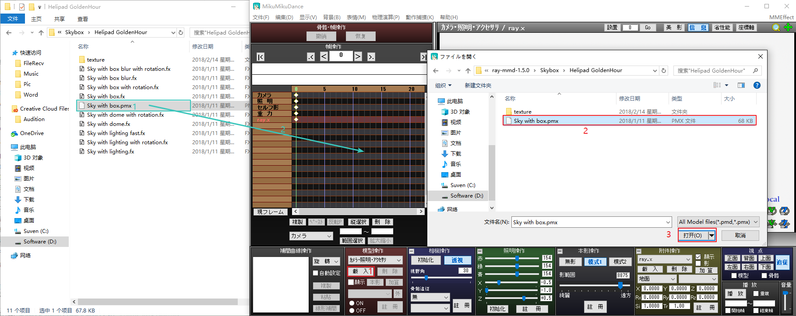
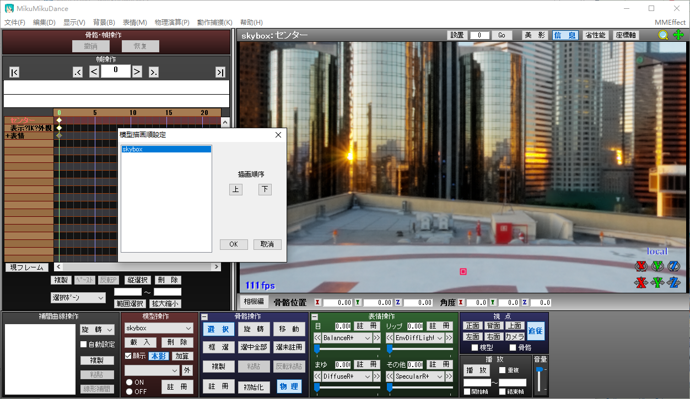
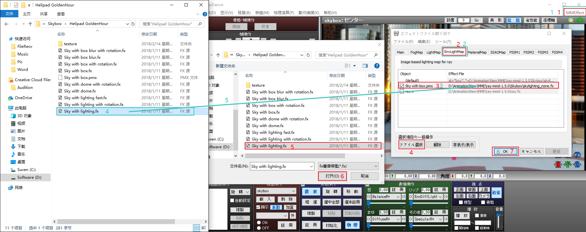
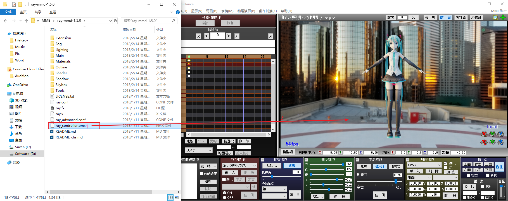
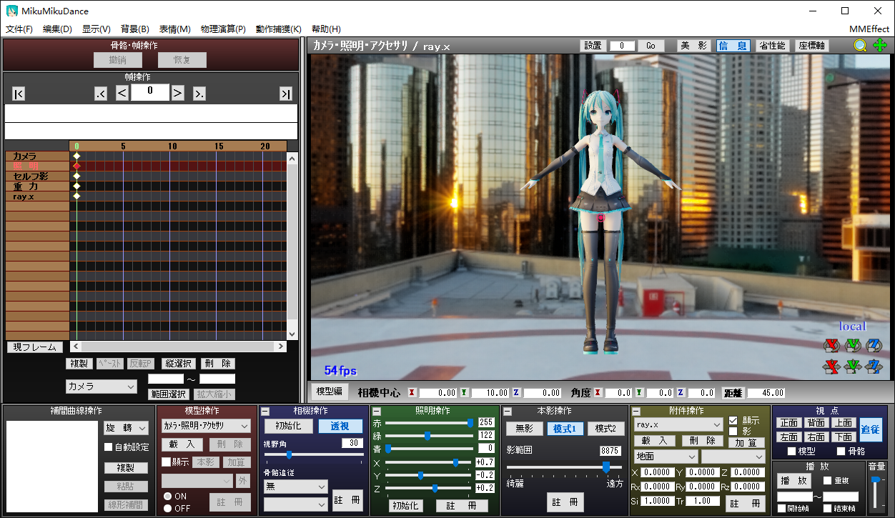

# ·Ray的入门使用
[返回目录](../ReadMe.md) 
[上一章 3.各文件夹说明](folderIntroduction.md)
## 说明
　这一页是为了帮助你快速入门Ray的载入，请按照以下步骤来载入Ray，因为是入门使用，所以更多高端的使用方法请参考每章的说明。

## 载入Ray-mmd

- ### 1.ray.x的载入  
    通过附件载入`ray.x`或者直接将`ray.x`拖入MMD中

    
    
    稍等一会，您将会看到黑色背景的MMD。  

    

- ### 2. 关闭自带抗锯齿，并开启一系列方便使用的功能  
    如图开启或关闭这些功能，您的MMD背景将会变为白色，左下角显示着实时帧率。

    

	开启或关闭后的样子
	

- ### 3. 天空球的载入  
    从Skybox文件夹添加天空球。详细情况请参考7.[天空球控制](skybox.md)。
	这里我们载入Helipad GoldenHour文件夹的天空球

    1. 打开“「Skybox\Helipad GoldenHour」”文件夹并将`Sky with box.pmx`添加到MMD。

        

    2. 在菜单栏-背景-模型描画顺序&模型计算顺序中将skybox放到顶部

        

    3. 在「EnvLightMap」将`Sky with lighting.fx`分配给skybox。（默认情况下，skybox分配的是`skylighting_none.fx`。）

        

    ※ 请确定`.fx`和skybox是同一个文件夹下中的，如果是不同文件夹的会导致光照信息不正确。

- ### 4. 添加模型  
    向MMD中添加模型、场景等，并在MME的「Main」的一栏为他们分配`main\main.fx` 。  
    ※　可以使用Shift和Ctrl进行多选。

    

    　当在「Main」为模型分配`main\main.fx` 后，在「MaterialMap」会默认的为模型分配 `Materials\material_2.0.fx` 。  
    　在之后章我们会讲解通过「MaterialMap」为模型的不同部位设置不同的材质。

    * 注意：  
    Ray不支持`.x`格式的模型，需要您将其转换为`.pmx`格式的模型。。

- ### 5. ray_controller.pmx的载入  
    将`ray_controller.pmx`按之前的方式在MMD中载入。  

    

    通过这个模型的表情作为控制器，你可以调整灯光、阴影、色调等。

- ### 6.到这里，我们就完成了入门的设置过程。  
    我们会根据需要添加其他的东西，并修改效果。具体请参考后面的章节。
    此刻我们已经完成了入门的设置过程。
    

* ### 关于添加顺序
    　添加顺序不一定要按照上面的方法进行。可以全部添加完了以后，在菜单栏-背景-附件控制中，将ray.x置于顶部，在菜单栏-背景-模型描画顺序&模型计算顺序中将skybox放到顶部。

* ### 当显示不如预想时
    在我们载入的时候，可能因为载入错误等情况，导致我们的显示出现了问题。请看以下图片确定你遇到的问题。

    * 没有被光找到的地方变成了黑色。  
        Skybox的「EnvLightMap」选项忘记设置。
    

    * 显示为绿色或紫色。  
        在之前载入的过程中，你可能错将Sky with lighting.fx分配到了「Main」。您最好先删掉skybox，然后重新载入Skybox。
    

-----

<small> Model : Hatsune Miku V4X Model by Digitrevx / 屋上風ステージ by KTY
感谢gaj-cg教程中出现的大部分图片可以直接使用
其中一些图片为我自己截图制作
</small>

[下一章 5.全局设置和MME效果分配](conf.md)
